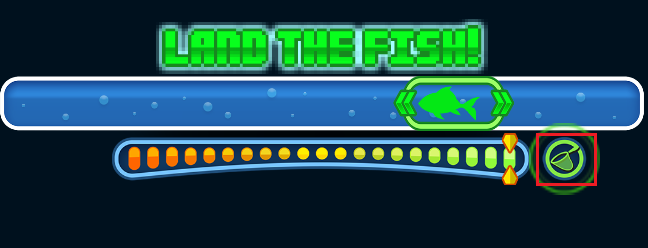
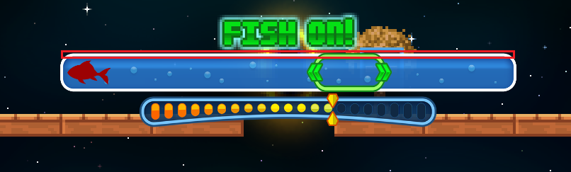
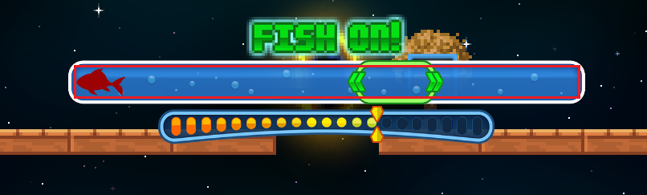
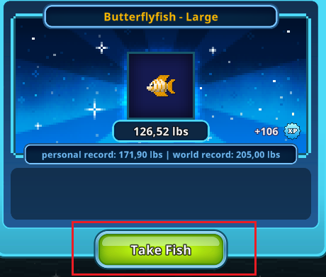
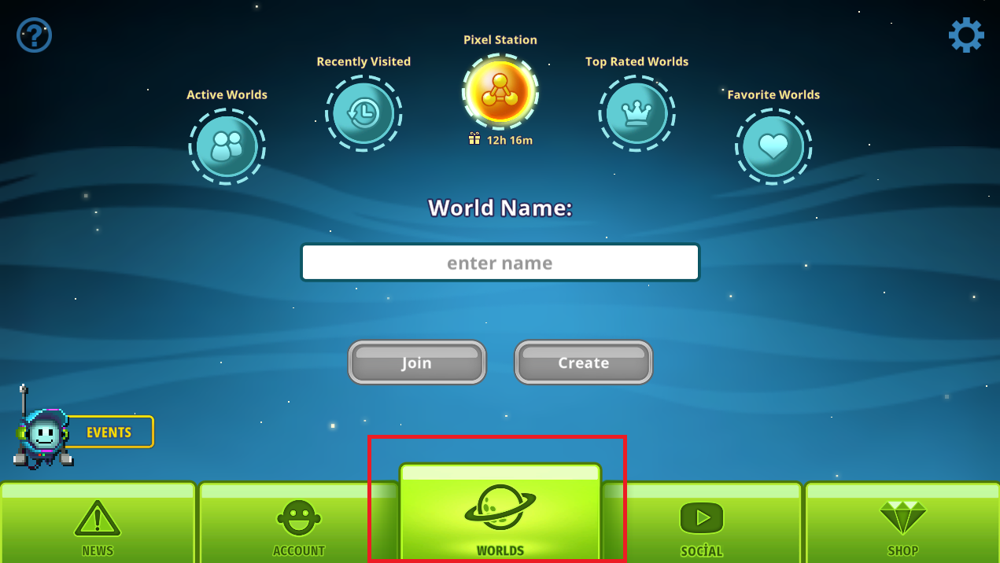
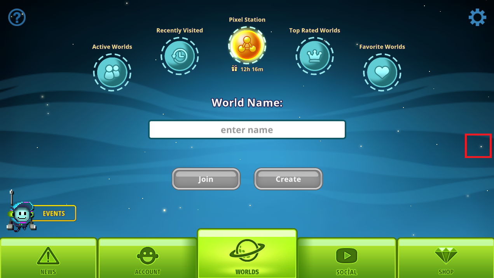
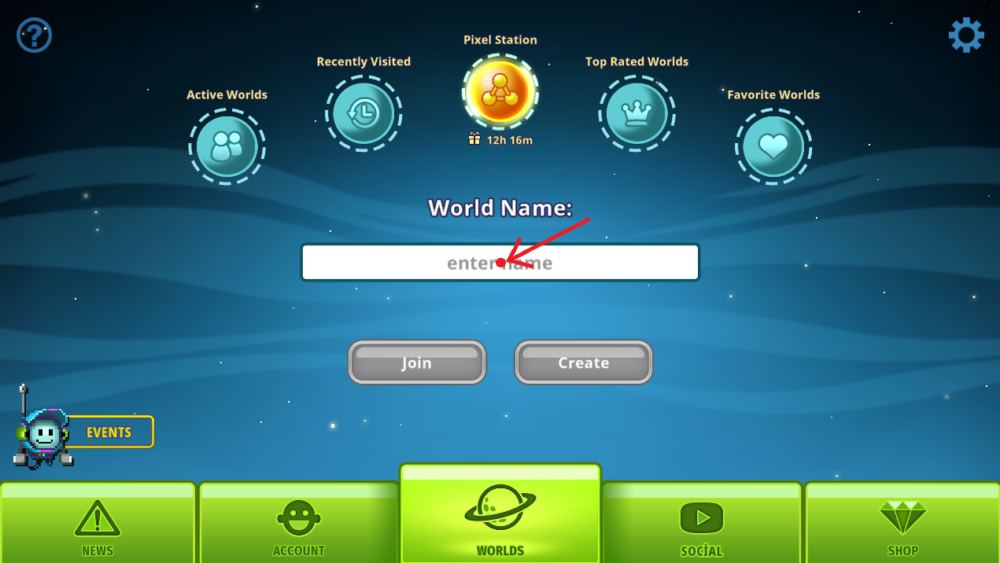
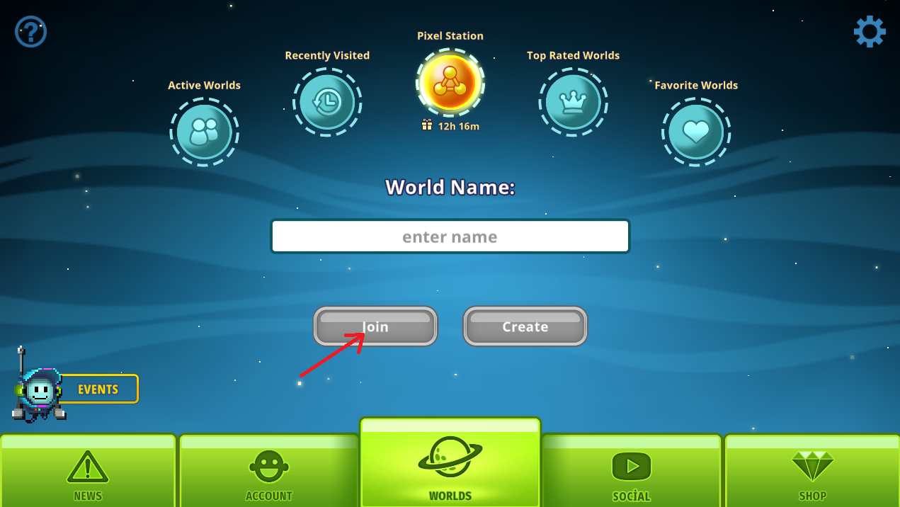

# FishAssist

A computer vision based fishing automation tool for **Pixel Worlds**, built with Python and OpenCV.

> All tunable parameters live in `config.json` — no need to touch the main script.

---

## Features

- Detects the **strike** indicator and reacts automatically
- Tracks fish position (dark/red fish via HSV masking, green fish via edge-template matching)
- Keeps the fish centered inside the minigame box using `A`/`D` key holds
- Gates the `W` key press on **net visibility + fish position** (fish must be within the error margin)
- **Auto-recovery**: detects disconnects, re-enters the world, and presses `C` to select the first inventory slot (bait), ready to cast again (requires a **Big Metal Fan** and **Vortex Portal** placed at the spawn point to push the character back into the fishing position)
- **Steam relaunch**: if the world screen cannot be found 3 times in a row, kills and relaunches the game via Steam
- Startup **lure limit prompt** — automatically closes the game and puts the PC to sleep when the limit is reached
- Saves a **stats report** (lures used, fish caught, runtime) on every exit

---

## Requirements

- Python 3.9+
- Windows (uses `powershell` for sleep and `os.startfile` for Steam launch)

Install dependencies:

```bash
pip install opencv-python numpy pyautogui mss pynput
```

---

## File Structure

```
FishAssist/
├── v5.py
├── config.json
├── strike.png
├── take.png
├── stolen.png
├── net.png
├── fish_lost.png
├── world.png
└── fish_green.png
```

All `.png` template files must be placed in the **same folder** as `v5.py`.

---

## Template Images

Crop these from your own game screen using a tool like ShareX or Snipping Tool:

| File | What to capture |
|---|---|
| `strike.png` | The "STRIKE!" text that appears when a fish bites |
| `take.png` | The "TAKE" button shown after the minigame ends |
| `net.png` | The net icon that appears during the minigame |
| `fish_lost.png` | The indicator shown when the fish escapes |
| `world.png` | A portion of the world-select screen (used to detect disconnects) |
| `fish_green.png` | The green fish sprite — crop tightly, right-facing only (the bot mirrors it for left) |

> **⚠️ Capturing your own assets:** You **must** capture all template images from your own screen at the exact resolution and zoom level you will use while running the bot. Take a full screenshot, then crop each template precisely using Paint or a background removal tool. Your game resolution, zoom level, and character position must remain **fixed and consistent** — any change will break detection. You can refer to the example assets in the repository as a starting point, but do not use them directly unless your setup is identical.
>
> **`fish_green.png` requires extra care.** The crop must be tight and clean with no extra pixels around the fish. Even a few pixels off will cause the edge-matching algorithm to fail or produce incorrect results. If the bot struggles to track green fish, recapture this asset first.

---

## ROI & Coordinates

**1. strike**


**2. box**


**3. fish**


**4. land**


**5. net**


**6. take**


**7. world**


**8. empty_area_click**


**9. enter_world_click**


**10. world_confirm_click**


---

## Configuration (`config.json`)

```json
{
  "world_name": "your_world",
  "recovery": {
    "no_strike_timeout_seconds": 60,
    "enter_world_click":  { "x": 956, "y": 529 },
    "world_confirm_click": { "x": 848, "y": 658 },
    "empty_area_click":   { "x": 1556, "y": 508 }
  },
  "roi": {
    "strike": { "top": 319, "left": 850,  "width": 302, "height": 139 },
    "box":    { "top": 265, "left": 643,  "width": 620, "height": 18  },
    "fish":   { "top": 285, "left": 647,  "width": 621, "height": 30  },
    "land":   { "top": 211, "left": 675,  "width": 562, "height": 56  },
    "net":    { "top": 332, "left": 1172, "width": 50,  "height": 40  },
    "take":   { "top": 713, "left": 841,  "width": 231, "height": 75  },
    "world":  { "top": 806, "left": 832,  "width": 249, "height": 105 }
  },
  "error_margin": {
    "normal_fish": 10,
    "green_fish":  21
  },
  "offsets": {
    "box_center":  16,
    "fish_center": 0
  }
}
```

### Key options

**`world_name`** — The world the bot will re-enter during recovery.

**`recovery.no_strike_timeout_seconds`** — How many seconds without a strike before the bot checks for a disconnect. Default: `60`.

**`recovery.*_click`** — Screen coordinates used during the recovery sequence. The order of operations is:

1. `empty_area_click` — clicks an empty area to dismiss any popup that may appear on the world screen (reward, announcement, etc.)
2. `enter_world_click` — clicks the world name input field (clicked twice to make sure it's focused)
3. `world_confirm_click` — confirms and enters the world after the name is typed

Adjust all three coordinates to match your screen layout.

**`roi.*`** — Screen regions (in pixels) that the bot captures for each detection task. If your game window is in a different position or resolution, update these. Use the included **ROI Selector** and **Coordinate Finder** tools in the repository to easily find the correct values for your setup.

**`error_margin`** — How far (in pixels) the fish is allowed to drift from the box center before the bot corrects. Lower = more reactive (may cause vibration). Higher = more relaxed. Separate values for normal and green fish.

**`offsets.box_center`** — Shifts the perceived center of the green box left or right. Useful if the box detection is consistently off to one side. Positive = shift right. To verify: watch the bot with a Superior Rod and see if the fish hugs one side of the box; if so, adjust this value.

**`offsets.fish_center`** — Same concept for fish detection. Usually `0` if `fish_green.png` was cropped precisely.

---

## Usage

1. Open Pixel Worlds and position your character at the fishing spot.
2. Run the script:
   ```bash
   python v5.py
   ```
3. Enter the number of lures you want to use when prompted.
4. Move your cursor to the **lure casting point** and press **Y**.
5. The bot starts automatically.

When the lure limit is reached, the game is closed and the PC is put to sleep.

To stop early, press **Ctrl+C** — stats are saved on exit.

---

## Notes

- Default ROI and recovery coordinates were tested on a **1920×1080** display with the game running in **1280×720 windowed** mode. All template images were also captured at this resolution. The default values assume **one zoom level out from the closest** in-game zoom. If your setup differs, update both `roi` and `recovery.*_click` values in `config.json`.
- If the bot fails to track dark/navy fish, your monitor color profile or GPU color settings may be affecting HSV detection. Try disabling any color enhancement settings in your GPU control panel (NVIDIA/AMD) and make sure no contrast or saturation adjustments are applied to the game window.
- Your **top inventory slot** must always contain bait before starting the bot.
- The bot uses randomized mouse movement and key timings to appear more natural.
- `fish_green.png` only needs to be cropped from the **right-facing** direction — the bot generates the mirrored version automatically.
