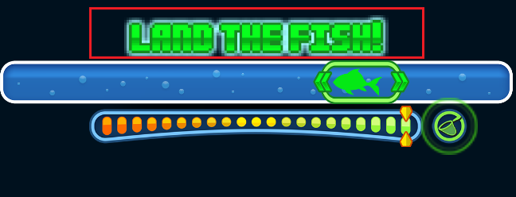
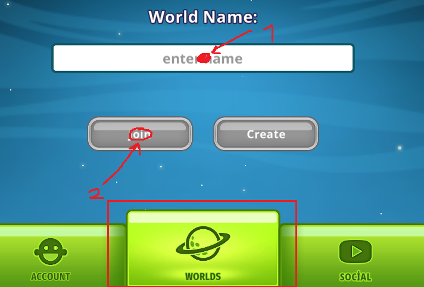
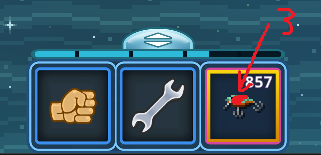

# FishAssist

FishAssist is an automated fishing tool designed for high efficiency and reliability. Unlike many macro tools that rely on fixed-time clicking, this project utilizes real-time image recognition to monitor the game state.

## Why FishAssist?

FishAssist is built on the philosophy of transparency and safety. It differs from standard market solutions in three key ways:

* **Non-Invasive Architecture:** FishAssist does not touch the game's memory, inject DLLs, or modify game files. Because it interacts purely with visual output, it is classified as an external automation tool rather than a game hack.
* **Full Transparency:** The project is 100% open source. You can inspect every line of code to verify its security. There are no hidden backdoors—just readable, trusted Python code.
* **Anti-Cheat Resilience:** Unlike standard "fixed-interval" macros, FishAssist mimics human reaction times and input patterns. This natural, unpredictable behavior significantly reduces the risk of detection by anti-cheat systems.

## What does FishAssist do?

FishAssist automates the entire fishing process in Pixel Worlds using advanced Computer Vision (OpenCV) techniques.

* **Intelligent Vision:** Instead of relying on unreliable static timers, the script "sees" the game screen in real-time. It processes visual feedback to determine exactly when to react to game events.
* **Full Automation:** From casting the line to reeling in the catch, the script manages the entire fishing loop uninterrupted.
* **Tireless Performance:** The only difference between FishAssist and a human player is that the bot does not need to sleep, eat, or rest. It provides consistent, high-efficiency fishing 24/7.

## Setup Guide

To ensure consistent performance, the bot requires a standardized environment.

### 1. Environment Standardization
* **Visual Consistency:** Keep your zoom level, game position, and screen resolution fixed.
* **Disconnect Protection:** For the automated disconnect protection to function, your character must reach the fishing spot within 5–10 seconds of spawning in your world. Use fan/portal configurations to ensure your character is positioned correctly immediately upon world entry.

### 2. Assets & Screenshots
The bot relies on template matching. You must capture screenshots of your own game screen to create your assets.
* **Quality:** Assets must be captured in full-screen mode and cropped precisely to match the sample files provided.
* **Transparency:** Ensure your `fish_green` file is saved with a transparent background. Without transparency, the detection algorithm will fail.

### 3. ROI Configuration
"ROI" stands for **Region of Interest**. These are the specific coordinates the bot monitors. Use the `selector.py` script to identify and save these coordinates to your `main.py` configuration.

#### ROI Selection Guide
| ROI Name | Description |
| :--- | :--- |
| `roi_strike` | The area containing the "Strike" text. Keep it tight to avoid color conflicts; a dark background is recommended. |
| `roi_kutu` | The thin box area shown in the reference image. |
| `roi_balik` | The main fishing area. **Critical:** Select this area carefully. |
| `roi_land` | The landing zone for the catch. |
| `roi_net` | The net capture zone. Define this area as concisely as possible. |
| `roi_take` | The interaction/collect area. |
| `roi_world` | The navigation area. Capture this widely (ignore arrows for now). |

### ROI Reference Images

**roi_kutu**

**roi_balik**

**roi_land**

**roi_net**

**roi_take**

**roi_world**

*Warning: Ensure all your assets are **smaller** than the designated ROI area. If an asset is larger than its assigned ROI, the code will fail to detect it.*

## Recovery Mode Configuration

Recovery Mode is a fail-safe mechanism that triggers if the bot detects a disconnection or prolonged inactivity. It searches for the `world.png` asset to initiate the automated reconnection process.

### Configuration Steps
1.  **Set World Name:** Open `main.py`, locate line 143, and replace `"YOUR WORLD"` with your actual world name.
2.  **Update Coordinates:** Use your coordinate finder script to determine the correct values:

* **Location #1:** Replace `guvenli_tikla(956, 529)` with the coordinates for the first recovery point.
* **Location #2:** Replace `guvenli_tikla(848, 658)` with the coordinates for the second recovery point.
* **Location #3:** Replace `guvenli_tikla(1041, 865)` with the coordinates for the third recovery point. **Note: Your inventory must be visible as shown in the image.**

## How to Use

Once your setup is correctly configured:
1.  **Positioning:** Move your character to your standardized fishing position.
2.  **Execution:** Run the script.
3.  **Bait Setup:** Select your desired bait in-game.
4.  **Calibration:** Press the **'Y'** key to define the exact location where the bait should be cast.

## Troubleshooting

* **Color Detection Issues:** If the bot fails to track the blue fish, it is likely due to differences in color profiles or graphics settings. You may need to update the color constants within the source code to match your specific screen output.
* **Internet Connectivity:** The Recovery Mode is designed to handle game-initiated disconnections or minor stutters. It cannot resolve a total loss of internet connectivity. Please ensure your connection is stable for continuous operation.

## License
This project is licensed under the **GNU General Public License v3.0**.